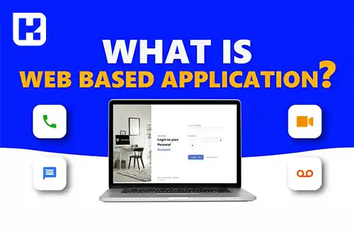

<blockquote class="faq-block">

  
آنچه در این مطلب خواهید خواند

  <ul>
    <li>نرم‌افزار تحت وب چیست؟</li>
    <li>کارایی و صرفه‌جویی در هزینه</li>
    <li>فرآیند اجرای نرم‌افزارهای تحت وب</li>
    <li>آیا نرم‌افزارهای تحت وب به نصب احتیاج دارند؟</a></li>
    <li>مثال‌هایی از نرم‌افزارهای تحت وب</li>
    <li>مثال‌هایی از نرم‌افزارهای ابری</li>
    <li>مزایای نرم‌افزارهای تحت وب</li>
    <li>معایب نرم‌افزارهای تحت وب</li>
    <li>تفاوت نرم‌افزار تحت وب و ابری</li>
    <li>سؤالات متداول</li>
    <li>جمع‌بندی </li>
  </ul>

</blockquote> 

نرم‌افزارهای تحت وب، برنامه‌هایی هستند که مستقیماً از طریق مرورگر اجرا شده و نیازی به نصب و راه‌اندازی روی دستگاه‌های کاربر ندارند. این نوع نرم‌افزار به کاربران امکان می‌دهد که تنها با دسترسی به اینترنت، از هر دستگاهی به برنامه‌های خود دسترسی داشته باشند. نرم‌افزارهای تحت وب با توجه به امکانات گسترده‌ای که فراهم می‌کنند، به یکی از پرکاربردترین ابزارها در دنیای دیجیتال تبدیل شده‌اند.

در این مقاله، به ساختار و کارکرد نرم‌افزارهای تحت وب، مزایا و معایب آنها و تفاوت‌های اصلی‌شان با نرم‌افزارهای ابری خواهیم پرداخت و با ارائه مثال‌های واقعی، درک عمیق‌تری از این فناوری ارائه می‌دهیم.

## نرم‌افزار تحت وب چیست؟

نرم‌افزار مبتنی بر وب برنامه‌ای است که از طریق مرورگر وب اجرا می‌شود. این نوع نرم‌افزار بر روی هر پلتفرمی که دارای مرورگر و اتصال به اینترنت باشد قابل استفاده است، به همین دلیل به آن برنامه‌های مرورگر محور نیز گفته می‌شود.

می‌توان یک برنامه مبتنی بر وب را نسخه پیشرفته‌تری از یک وب‌سایت در نظر گرفت. به طور معمول، وب‌سایت‌ها اطلاعاتی را در اختیار شما قرار می‌دهند که می‌توانید به عنوان یک خواننده مشاهده کنید اما تعامل شما با آن‌ها معمولاً محدود است. نرم‌افزارهای تحت وب علاوه بر نمایش اطلاعات، امکان تعامل بیشتر و انجام عملیات پیچیده‌تری مانند ویرایش، ذخیره‌سازی و ارسال داده‌ها را فراهم می‌کنند.

---

### کارایی و صرفه‌جویی در هزینه
نرم‌افزارهای تحت وب به دلیل سرعت و عملکرد بهتر، امکان دسترسی آسان از طریق موبایل، تبلت و لپ‌تاپ را فراهم می‌کنند و نیازی به منابع سخت‌افزاری قوی ندارند. این نرم‌افزارها به طور کامل از منابع سرور استفاده می‌کنند و کاربران می‌توانند از سخت‌افزارهای معمولی خود برای استفاده از آن‌ها بهره‌برداری کنند. مسئولیت تأمین و به‌روزرسانی سخت‌افزار سرور بر عهده سازمان است و کاربران نگران نیازهای سخت‌افزاری نیستند.

همچنین، نرم‌افزارهای تحت وب تنها توسط یک تیم IT روی سرور مرکزی مدیریت می‌شوند، در حالی که نرم‌افزارهای نصب‌شده روی رایانه‌های شخصی به نگهداری جداگانه نیاز دارند. این ویژگی در مقیاس بزرگ باعث می‌شود هزینه‌های نگهداری سیستم‌های تحت وب به‌طور قابل‌توجهی کاهش یابد.

---

### فرآیند اجرای نرم‌افزارهای تحت وب

نرم ‌افزارهای تحت وب شامل دو بخش اصلی هستند که با زبان‌های برنامه‌نویسی متفاوتی نوشته می‌شوند: یک بخش سمت سرور و یک بخش سمت کاربر (Client). این نرم ‌افزارها برای اجرا به ترکیب این دو زبان نیاز دارند و از اسکریپت‌های سمت سرور و سمت کاربر استفاده می‌کنند. زبان‌های برنامه‌نویسی سمت کاربر شامل HTML ،CSS و JavaScript هستند که توسط مرورگر پشتیبانی می‌شوند. زبان‌های سمت سرور شامل پایتون (Python)، پی‌اچ‌پی (PHP) و دات‌نت (ASP.NET) می‌باشند.

در این فرایند، کاربر ابتدا درخواست خود را از طریق شبکه یا اینترنت به سرور وب ارسال می‌نماید. وب‌سرور درخواست را بررسی کرده و به بخش سرویس‌دهنده ارسال می‌کند. بخش سرویس‌دهنده درخواست را اجرا کرده و نتیجه را به وب‌سرور برمی‌گرداند. سپس، داده‌های مورد نظر به دستگاه کاربر ارسال و نمایش داده می‌شود. این فرآیند با سرعت بالا انجام می‌شود و باعث خستگی کاربر نمی‌گردد.

---

### آیا نرم‌افزارهای تحت وب به نصب احتیاج دارند؟
این نرم‌افزارها مستقیماً از سرورها بارگیری شده و در مرورگرها اجرا می‌شوند، بنابراین نیازی به دانلود و نصب ندارند. به عبارت دیگر، با داشتن دسترسی به اینترنت و یک مرورگر وب مانند Google Chrome ،Mozilla Firefox یا Safari، می‌توانید در هر زمان و مکانی و با هر دستگاهی از آنها استفاده کنید.

اما منظور از نصب این نرم ‌افزارها چیست؟ وقتی از گوشی‌های هوشمند برای استفاده از این نرم‌افزارها بهره می‌برید، می‌توانید با ایجاد یک میانبر (Shortcut) روی صفحه اصلی گوشی، آیکونی مشابه نرم‌افزارهای نصب‌شده برای آنها بسازید و از این میانبر به‌عنوان یک اپلیکیشن موبایل استفاده کنید. در این حالت، به نظر می‌رسد که این نرم‌افزارها را نصب کرده‌اید، در حالی که واقعاً یک صفحه مرورگر باز می‌شود و برای استفاده کامل از آنها به اتصال اینترنت نیاز دارید.

---

### مثال‌هایی از نرم‌افزارهای تحت وب
بسیاری از سیستم‌های نرم‌افزاری که به طور روزانه با آن‌ها کار می‌کنیم، برنامه‌های تحت وب هستند. برخی از این برنامه‌ها بسیار شناخته شده و برخی دیگر کمتر مورد توجه قرار گرفته‌اند. به عنوان نمونه، می‌توان به پلتفرم‌های زیر اشاره کرد:

- **Google Docs**: ابزاری برای ویرایش اسناد آنلاین.
- **Microsoft 365**: مجموعه‌ای از برنامه‌ها برای انجام امور روزانه اداری.
- **Google Sheets**: ابزار مدیریت داده‌ها و محاسبات آنلاین.
- **Google Slides**: ابزاری برای ساخت و ارائه اسلایدهای آنلاین.

### مثال‌هایی از نرم‌افزارهای ابری

1. **Google Drive** – یک پلتفرم ابری برای ذخیره‌سازی و اشتراک‌گذاری فایل‌ها که امکان دسترسی به اسناد، عکس‌ها و دیگر فایل‌ها از هر دستگاهی را فراهم می‌آورد.
2. **Dropbox** – یک سرویس ابری برای ذخیره و اشتراک‌گذاری فایل‌ها که از هر دستگاه متصل به اینترنت قابل دسترسی است.
3. **Amazon Web Services (AWS)** – مجموعه‌ای از خدمات ابری برای ذخیره‌سازی داده، پردازش، تحلیل و دیگر نیازهای مرتبط با زیرساخت فناوری اطلاعات.
4. **Microsoft Azure** – پلتفرم ابری که توسط مایکروسافت ارائه می‌شود و خدماتی مانند ذخیره‌سازی داده، تحلیل و سرویس‌های مختلف ابری را در اختیار کاربران قرار می‌دهد.
5. **Salesforce** – یک نرم‌افزار ابری معروف در زمینه مدیریت ارتباط با مشتری (CRM) که شرکت‌ها می‌توانند از آن برای مدیریت فروش، خدمات مشتری و بازاریابی استفاده کنند.

---

### مزایای نرم‌افزارهای تحت وب

- **عدم نیاز به ارتقاء نرم‌افزار**: کاربران نیازی به نصب نسخه‌های جدید ندارند و همیشه به آخرین نسخه دسترسی دارند.
- **امنیت بیشتر**: داده‌ها در سرور مرکزی ذخیره شده و از نظر امنیتی کنترل بیشتری روی آن‌ها وجود دارد.
- **دسترسی راحت و سریع**: با داشتن اتصال اینترنت و یک مرورگر، کاربران می‌توانند از هر دستگاهی به نرم‌افزار دسترسی پیدا کنند.
- **قابلیت کنترل دسترسی کاربران**: مدیران می‌توانند دسترسی کاربران مختلف را مدیریت کنند.
- **سرعت بیشتر**: بسیاری از نرم‌افزارهای تحت وب به گونه‌ای طراحی شده‌اند که سرعت اجرا بالا باشد.
- **امکان ذخیره‌سازی اطلاعات در برنامه**: اطلاعات به طور مداوم و آنلاین ذخیره می‌شوند.
- **سازگاری با تمامی سیستم‌عامل‌ها**: نرم‌افزارهای تحت وب معمولاً با تمامی سیستم‌عامل‌ها مانند ویندوز، macOS و لینوکس سازگار هستند.

---

### معایب نرم‌افزارهای تحت وب
نرم‌افزارهای تحت وب برای عملکرد صحیح به اینترنت نیاز دارند که این موضوع یکی از نقاط ضعف اصلی آن‌ها محسوب می‌شود. در مواقعی ممکن است به اینترنت دسترسی نداشته باشید و هنوز هم در بسیاری از مناطق جهان اینترنت در دسترس نیست. بدون اتصال پایدار به اینترنت، استفاده از این برنامه‌ها غیرممکن می‌شود.

---

### نرم‌افزار تحت وب و ابری چه تفاوت‌هایی دارند؟
همه نرم‌افزارهای ابری بر بستر وب اجرا می‌شوند، اما همه نرم‌افزارهای تحت وب ابری نیستند و این مهم‌ترین تفاوت میان این دو نوع نرم‌افزار است.

اگرچه شباهت‌های زیادی میان این دو سیستم وجود دارد اما تفاوت‌های ظریفی نیز بین آنها دیده می‌شود:

- **ساختار**: هر دو به دسترسی آنلاین و اینترنت نیاز دارند؛ اما نرم‌افزارهای ابری همیشه به مرورگر وب وابسته نیستند و از هر مکانی قابل دسترسی هستند. در مقابل، نرم‌افزارهای تحت وب اغلب Multi-Tenancy نیستند، در حالی که نرم‌افزارهای ابری چنین قابلیتی دارند و برای کاربران انعطاف‌پذیری بیشتری فراهم می‌کنند.
- **قابلیت سفارشی‌سازی**: نرم‌افزارهای ابری می‌توانند متناسب با نیازهای خاص کاربر سفارشی‌سازی شوند، در حالی که نرم‌افزارهای وب خدمات یکسانی به همه کاربران ارائه می‌دهند و معمولاً قابل سفارشی‌سازی نیستند.
- **پشتیبانی Back-End و امنیت**: برنامه‌های ابری از طریق Back-End مدیریت می‌شوند، امنیت بالاتری دارند و از دسترسی‌های چندگانه و مقیاس‌پذیری پشتیبانی می‌کنند. این قابلیت‌ها نیازمند Data Mirroring و همگام‌سازی سریع داده‌ها هستند. در مقابل، نرم‌افزارهای تحت وب اغلب به دلیل استفاده از سرور راه دور و مرورگر، از این ویژگی‌ها بهره‌مند نیستند.
- **حفاظت از اطلاعات حساس**: نرم‌افزارهای تحت وب اطلاعات را از سرورهای داده شرکت بازیابی و تأیید می‌کنند، در حالی که نرم‌افزارهای ابری می‌توانند سطح امنیتی بیشتری برای محافظت از اطلاعات حساس کاربران ارائه دهند و محیطی امن‌تر فراهم سازند.

---

<blockquote class="faq-block">

آیا برای استفاده از نرم‌افزارهای تحت وب همیشه اینترنت لازم است؟
  بله، بدون اتصال اینترنت نمی‌توان از نرم‌افزارهای تحت وب استفاده کرد. برخی نرم‌افزارها امکان عملکرد محدود آفلاین دارند. 

</blockquote>

<blockquote class="faq-block">

آیا نرم‌افزارهای تحت وب امن هستند؟
  امنیت بستگی به پیاده‌سازی سرور دارد. داده‌ها معمولاً روی سرور مرکزی ذخیره می‌شوند و کنترل بیشتری دارند، اما همواره رعایت مسائل امنیتی مانند رمزنگاری و کنترل دسترسی ضروری است. 

</blockquote>

<blockquote class="faq-block">

آیا نرم‌افزارهای تحت وب با همه مرورگرها سازگار هستند؟
  بیشتر نرم‌افزارهای تحت وب با مرورگرهای رایج مانند Chrome، Firefox و Safari سازگار هستند، اما برخی ویژگی‌ها ممکن است در مرورگرهای قدیمی محدود باشد. 

</blockquote>

<blockquote class="faq-block">

تفاوت اصلی نرم‌افزار تحت وب و نرم‌افزار ابری چیست؟
  همه نرم‌افزارهای ابری بر بستر وب اجرا می‌شوند اما همه نرم‌افزارهای تحت وب ابری نیستند. نرم‌افزارهای ابری امنیت، مقیاس‌پذیری و انعطاف‌پذیری بیشتری دارند. 

</blockquote>

<blockquote class="faq-block">

آیا نرم‌افزارهای تحت وب نیاز به نصب دارند؟
  خیر، نرم‌افزارهای تحت وب مستقیماً در مرورگر اجرا می‌شوند و نیازی به نصب روی سیستم کاربر ندارند. فقط دسترسی به اینترنت و مرورگر لازم است. 

</blockquote>

<blockquote class="faq-block">

مزیت اصلی نرم‌افزارهای تحت وب نسبت به نرم‌افزارهای دسکتاپ چیست؟
  اصلی‌ترین مزیت، دسترسی آسان از هر دستگاه و کاهش هزینه‌های نگهداری و به‌روزرسانی است. مدیریت متمرکز سرور باعث ساده‌تر شدن نگهداری می‌شود. 

</blockquote>

---

### جمع‌بندی
نرم‌افزارهای تحت وب، به دلیل ویژگی‌هایی مانند عدم نیاز به نصب، کاهش هزینه‌های نگهداری و امکان دسترسی از هر دستگاهی که به اینترنت وصل است، ابزاری بسیار مفید در دنیای دیجیتال محسوب می‌شوند. با این حال، معایبی همچون وابستگی به اینترنت و امنیت نسبتاً محدود از جمله چالش‌های این نرم‌افزارها هستند. در مقابل، نرم‌افزارهای ابری با ارائه قابلیت‌هایی نظیر مقیاس‌پذیری، سفارشی‌سازی بیشتر و امنیت بالاتر، نیازهای پیچیده‌تری را پوشش می‌دهند.